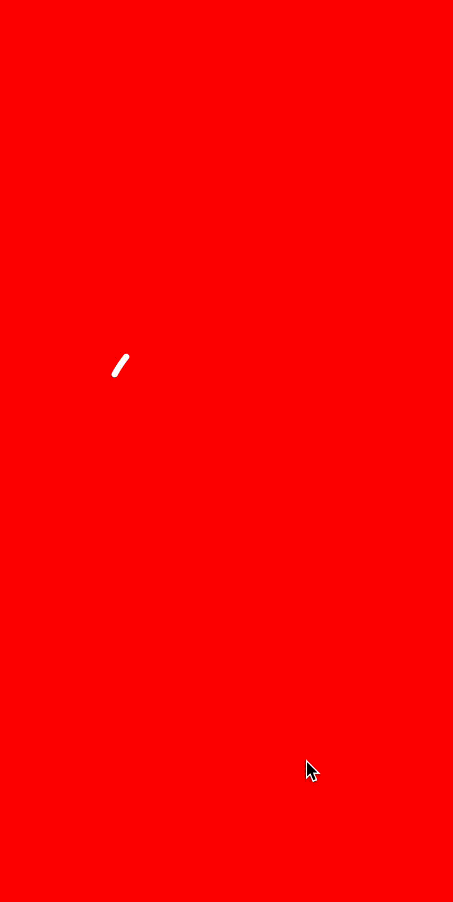

# Shadowplay

iOS Animation library by swift

Create animations easily with chained syntax

Example (A loading animation):



Before:

```swift
let beginTime: Double = 0.5
let strokeStartDuration: Double = 1.2
let strokeEndDuration: Double = 0.7

let rotationAnimation = CABasicAnimation(keyPath: "transform.rotation")
rotationAnimation.byValue = Float.pi * 2
rotationAnimation.timingFunction = CAMediaTimingFunction(name: .linear)

let strokeEndAnimation = CABasicAnimation(keyPath: "strokeEnd")
strokeEndAnimation.duration = strokeEndDuration
strokeEndAnimation.timingFunction = CAMediaTimingFunction(controlPoints: 0.4, 0.0, 0.2, 1.0)
strokeEndAnimation.fromValue = 0
strokeEndAnimation.toValue = 1

let strokeStartAnimation = CABasicAnimation(keyPath: "strokeStart")
strokeStartAnimation.duration = strokeStartDuration
strokeStartAnimation.timingFunction = CAMediaTimingFunction(controlPoints: 0.4, 0.0, 0.2, 1.0)
strokeStartAnimation.fromValue = 0
strokeStartAnimation.toValue = 1
strokeStartAnimation.beginTime = beginTime

let groupAnimation = CAAnimationGroup()
groupAnimation.animations = [rotationAnimation, strokeEndAnimation, strokeStartAnimation]
groupAnimation.duration = strokeStartDuration + beginTime
groupAnimation.repeatCount = .infinity
groupAnimation.isRemovedOnCompletion = false
groupAnimation.fillMode = .forwards

animationLayer.add(groupAnimation, forKey: nil)
```

After:

```swift
animationLayer.sp.concurrent([
            .basic(key: "transform.rotation" ,by: Float.pi * 2, extras: [.timingFunction(CAMediaTimingFunction(name: .linear))]),
            .basic(key: "strokeEnd", from: 0, to: 1, extras: [.duration(strokeEndDuration), .timingFunction(CAMediaTimingFunction(controlPoints: 0.4, 0, 0.2, 1))]),
            .basic(key: "strokeStart", from: 0, to: 1, extras: [.duration(strokeStartDuration), .beginTime(beginTime), .timingFunction(CAMediaTimingFunction(controlPoints: 0.4, 0, 0.2, 1.0))])
            ], options: [
            .duration(strokeStartDuration + beginTime),
            .repeatCount(.infinity),
            .removeOnCompletion(false),
            .fillMode(.forwards)
        ]).run()
```

